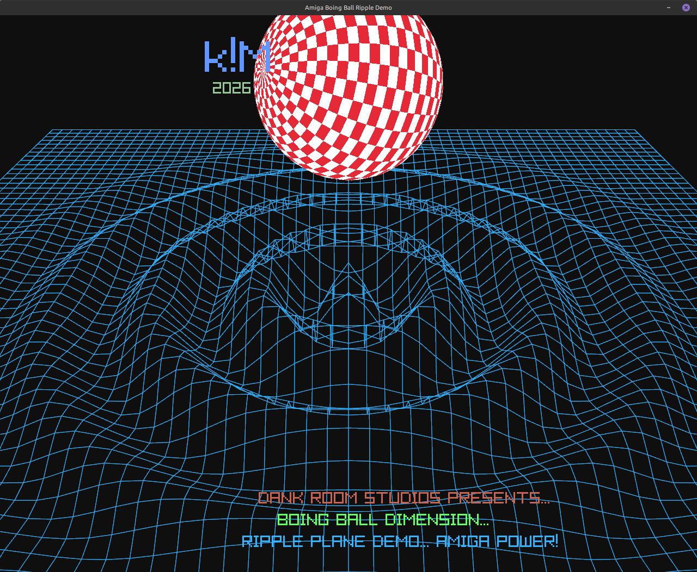

# raylib-water-plane

C demo that renders a dynamic 3D rippling water grid, an Amiga-style horizontal copper-bar background gradient, and a bouncing Amiga Boing Ball above the ripple center.

Modern C(`99`) implementation using Raylib—the go-to lightweight C framework for modern graphics and demoscene prototyping. It compiles cleanly on Windows, Linux, and macOS without low-level boilerplate.

